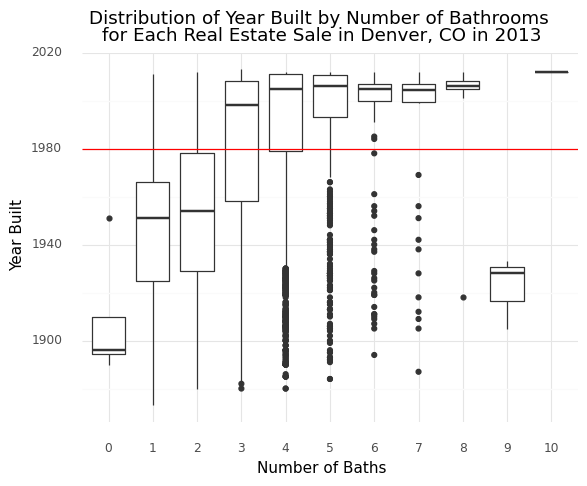
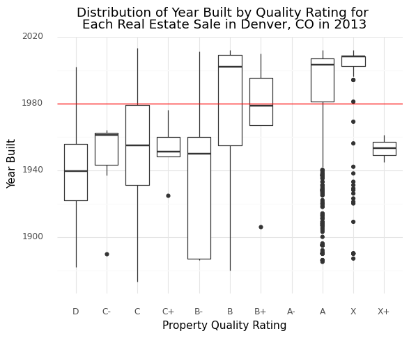
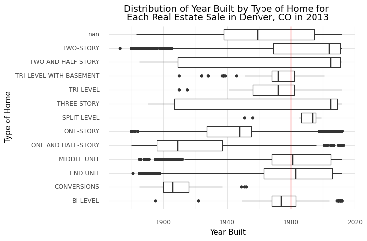
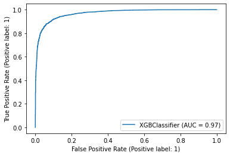
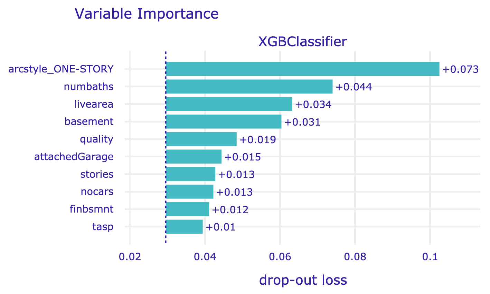

# Project 4: Using Machine Learning to Make Predictions
## __Predicting if a house was built before 1980__
-----------------------------------------------------
## Data Exploration
The following charts explore the possible relationships between the target variable and some features in the data. A red line was added to each chart to highlight the threshold year of 1980.

Chart 1 shows the relationship between the year the house was built by the number of bathrooms the house contains.

Chart 2 shows the relationship between the year the house was built by the quality rating of the home.

Chart 3  shows the relationship between the year the home was built by the type of home.

## Models
The classifier models I created are Logistic Regression, Multilayer Perceptron, Random Forest, Decision Tree, and XGBoost. The XGBoost classifier performed the best overall with 97% training accuracy and 91% testing accuracy. The Random Forest classifier performed second best, with accurracies only slightly less than XGBoost.

### XGBoost Classifier Roc Plot
As shown in the plot below, the XGBoost classifier has 97% area under the curve, the highest of all the models I tried.

### XGBoost Confusion Matrix
|XGBoost  | Predicted: 0 | Predicted: 1 |
|---------|--------------|--------------|
|Actual: 0|    2382      |       302    |
|Actual: 1|     329      |      4125    |
- Of the 2684 homes built after 1980, 2382 of them were correctly classified by the model with 302 incorrectly classified as being built before 1980. 
- Of the 4454 homes built before 1980, 4125 of them were correctly classified by the model with 329 incorrectly classified as being built after 1980.

### XGBoost Variable Importance Chart
The following chart shows the variables that the XGBoost model determined were most important when classifying homes as being built before or after 1980.

### XGBoost Metrics Table
| XGBoost    |   Precision  |    Recall    |  f1-score  |  support  |
|------------|--------------|--------------|------------|-----------|
|     0      |     0.89     |     0.88     |    0.88    |   2711    |
|     1      |     0.93     |     0.93     |    0.93    |   4427    |
|  Accuracy  |              |              |    0.91    |   7138    |
| Macro Avg  |     0.91     |     0.91     |    0.91    |   7138    |
|Weighted Avg|     0.91     |     0.91     |    0.91    |   7138    |
- This model has an average of 91% precision, meaning that 91% of the homes that were predicted to have been built before 1980 actually were built before 1980.
- An average recall score of 91% was achieved by this model, meaning that out of all the homes that were built before 1980, this model correctly identified 91% of them.

